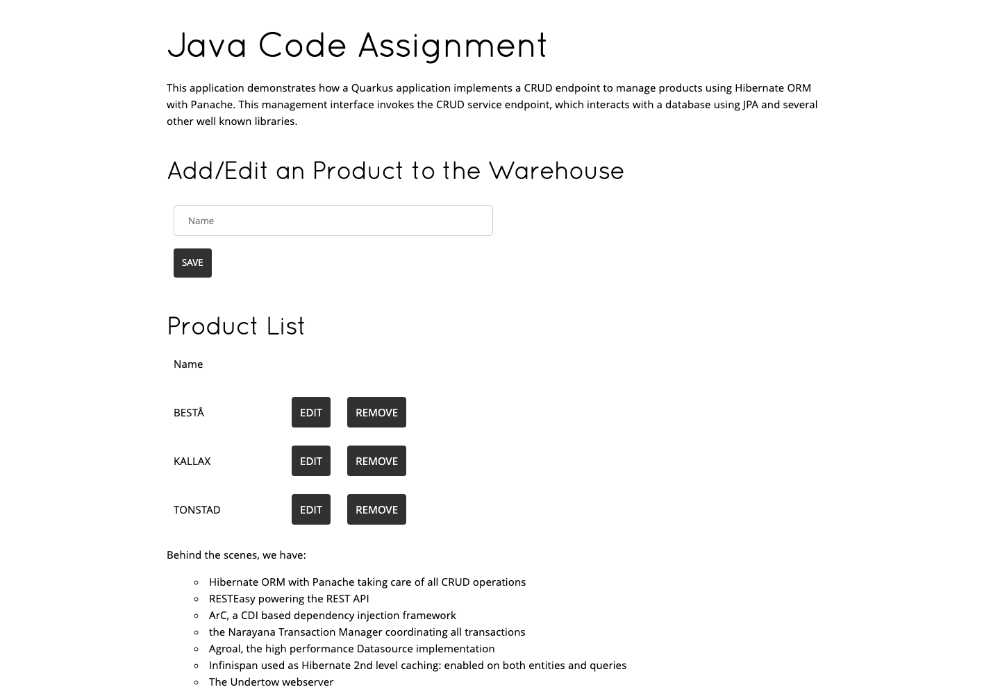
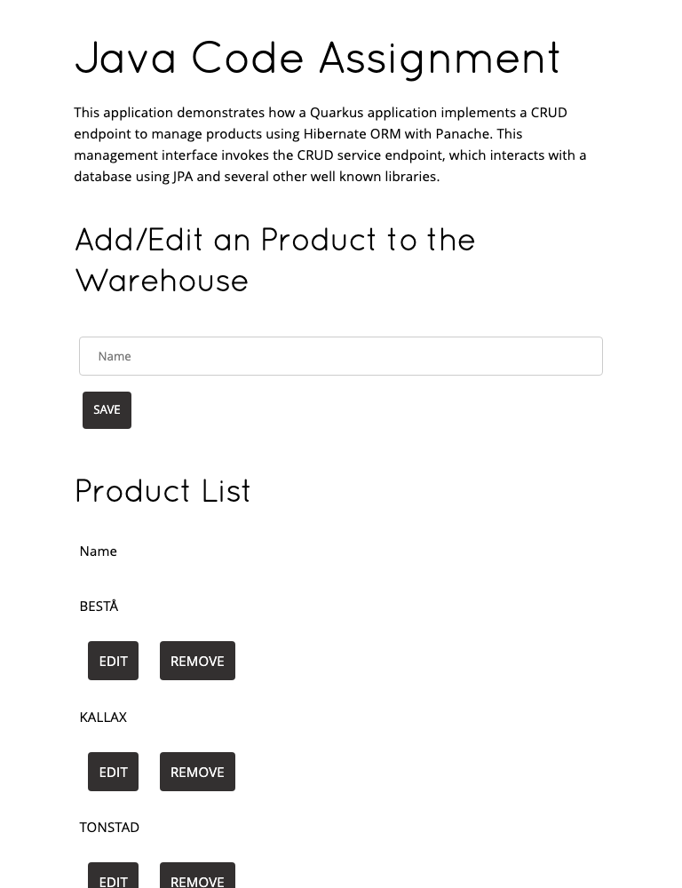

# Warehouse Colocation and Fulfilment Service

A Quarkus application for managing stores, products, warehouses, and the
warehouse fulfilment units assigned to each store. It supports warehouse
creation, archival and replacement while enforcing location, capacity, stock,
and fulfilment constraints.

[](https://github.com/deepak-kumar-goyal/fcs-assignment/actions/workflows/ci.yml)

## Application screenshots

Desktop product management:



Compact layout:



## Technology

- Java 17 and Quarkus 3
- RESTEasy Reactive and Jackson
- Hibernate ORM with Panache
- H2 for development and tests; PostgreSQL for packaged production mode
- JUnit 5, REST Assured, and JaCoCo
- OpenAPI-generated warehouse endpoint contract

## Project structure

The application is in `java-assignment`. Warehouse and fulfilment business
rules are isolated from transport and persistence code:

```text
com.fulfilment.application.monolith
├── fulfilment
│   ├── adapters/database
│   ├── adapters/restapi
│   ├── application
│   └── domain
│       ├── model
│       └── validator
└── warehouses
    ├── adapters
    └── domain
        ├── models
        ├── ports
        ├── usecases
        └── validators
```

## Run locally

Prerequisite: JDK 17 or newer. Dev mode uses an in-memory H2 database and
loads seed data from `import.sql`, so Docker is not required.

```sh
cd java-assignment
chmod +x mvnw
./mvnw quarkus:dev
```

Open [http://localhost:8080/index.html](http://localhost:8080/index.html).

## Test and coverage

```sh
cd java-assignment
./mvnw clean test
open target/jacoco-report/index.html
```

The build fails if either instruction or line coverage falls below 81%.
The current baseline is 45 passing tests, 84.6% instruction coverage, and
85.6% line coverage. See [the coverage report](docs/COVERAGE.md) for tracking
details. CI also retains the generated HTML report as an artifact for 30 days.

## API overview

Base URL: `http://localhost:8080`

| Area | Methods | Path |
| --- | --- | --- |
| Stores | GET, POST | `/store` |
| Stores | GET, PUT, PATCH, DELETE | `/store/{id}` |
| Products | GET, POST | `/product` |
| Products | GET, PUT, DELETE | `/product/{id}` |
| Warehouses | GET, POST | `/warehouse` |
| Warehouses | GET, DELETE | `/warehouse/{id}` |
| Warehouses | POST | `/warehouse/{businessUnitCode}/replacement` |
| Fulfilment | GET, POST | `/store/{storeId}/fulfilment` |
| Fulfilment | DELETE | `/store/{storeId}/fulfilment/{id}` |

Example requests:

```sh
curl http://localhost:8080/warehouse

curl -s -X POST http://localhost:8080/warehouse \
  -H 'Content-Type: application/json' \
  -d '{"businessUnitCode":"MWH.200","location":"EINDHOVEN-001","capacity":30,"stock":4}'

curl -s -X POST http://localhost:8080/store/2/fulfilment \
  -H 'Content-Type: application/json' \
  -d '{"productId":2,"warehouseBusinessUnitCode":"MWH.023"}'
```

## Further documentation

- [Detailed Java application guide](java-assignment/README.md)
- [Assignment requirements](java-assignment/CODE_ASSIGNMENT.md)
- [Written questions](java-assignment/QUESTIONS.md)
- [Case study](case-study/CASE_STUDY.md)
